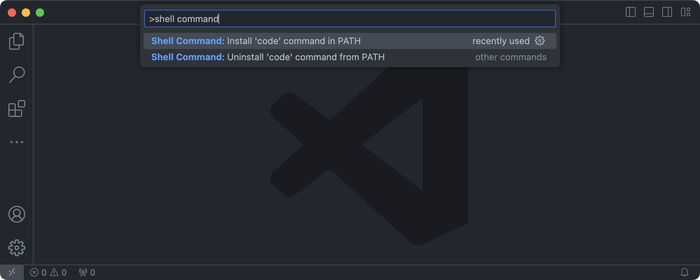
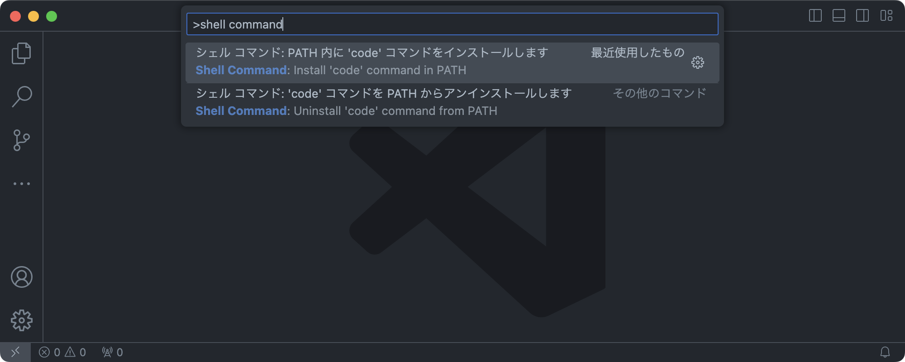
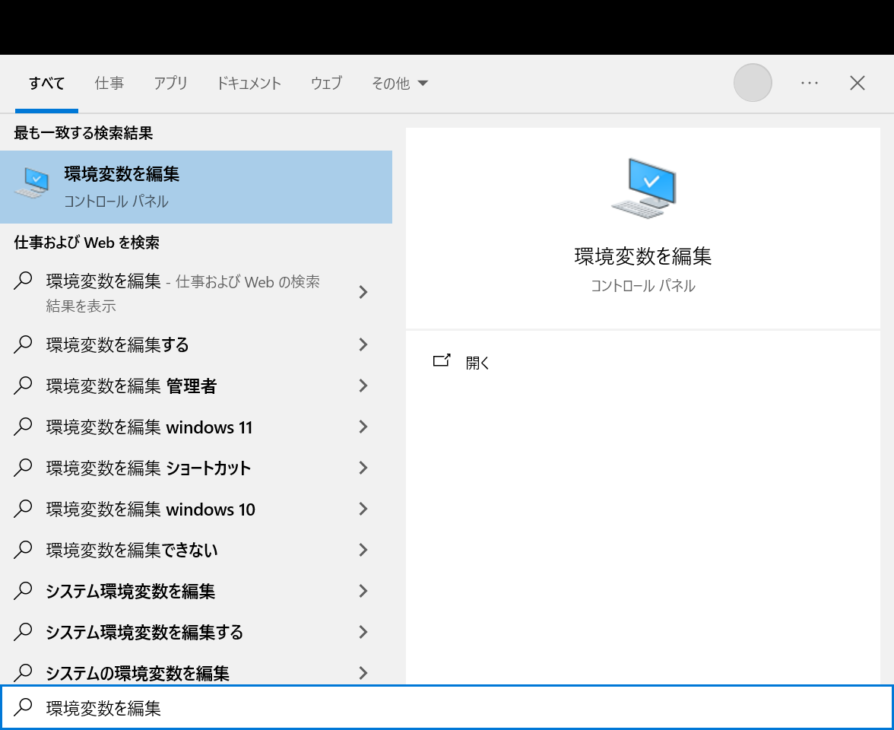
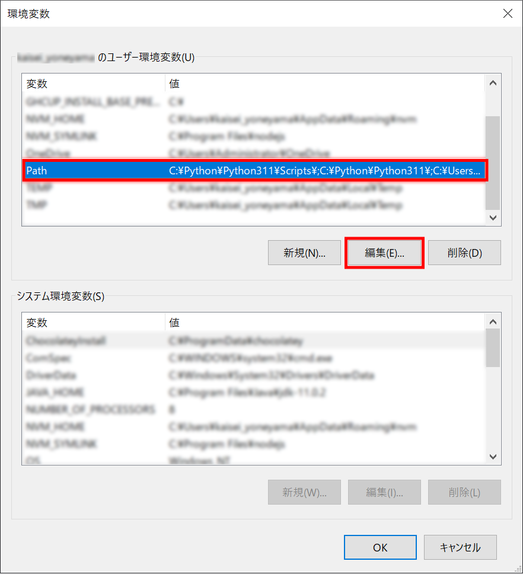
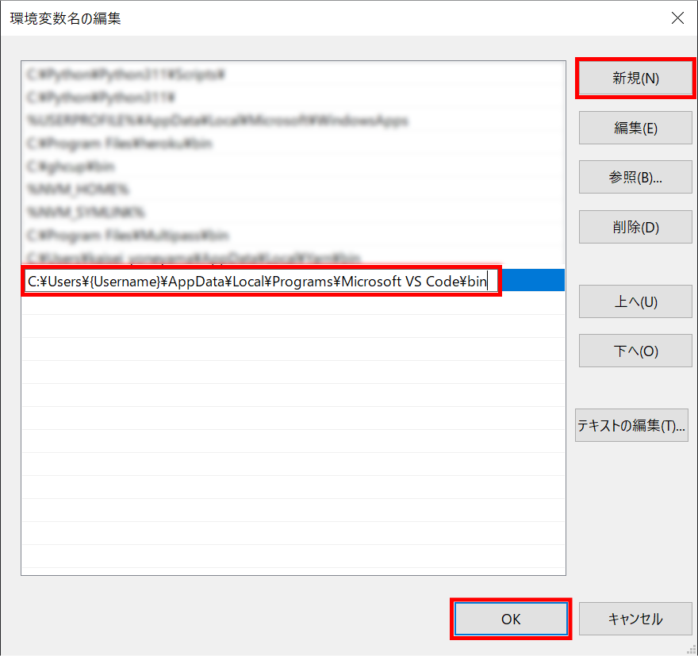
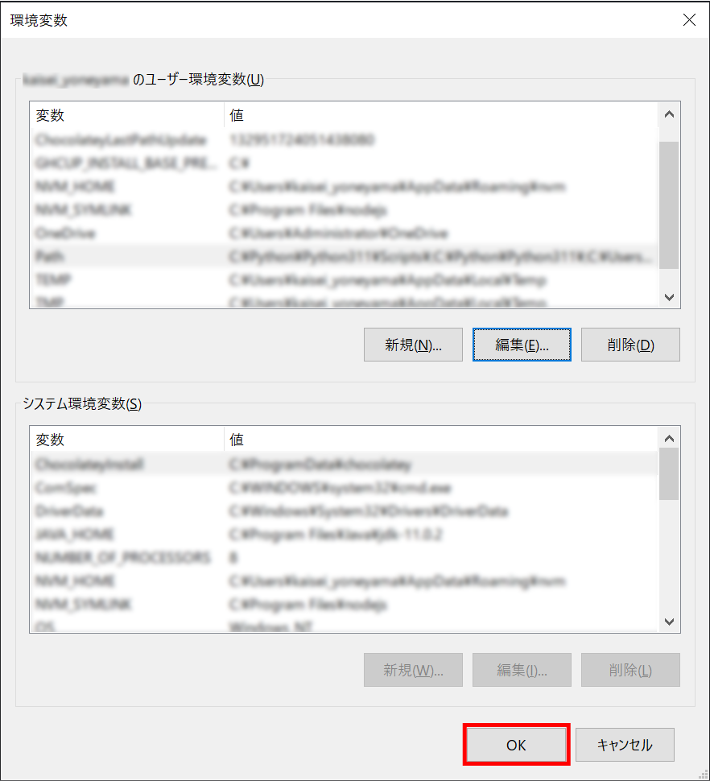
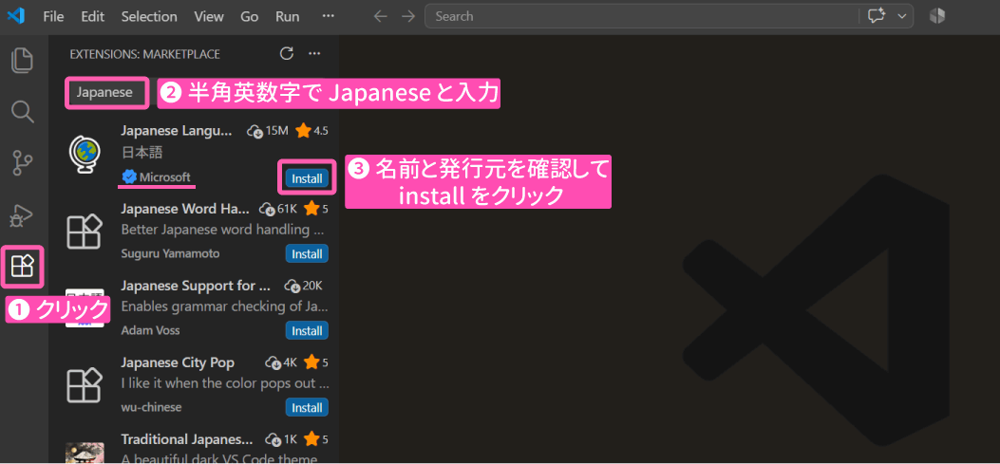
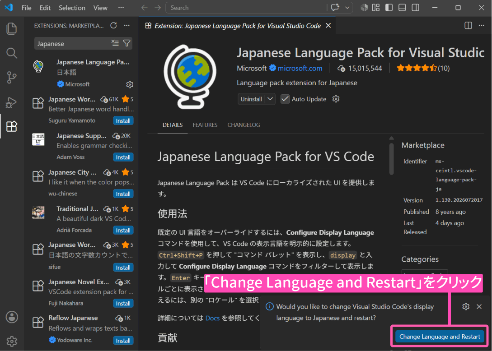
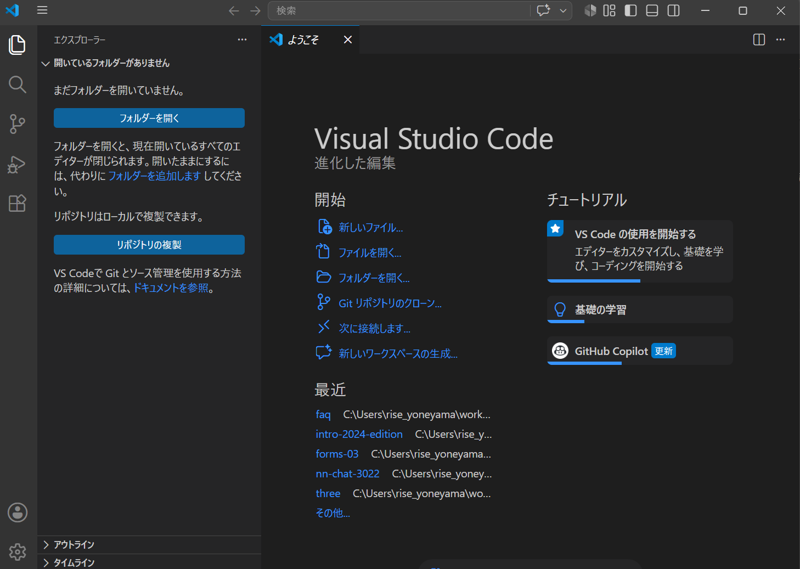
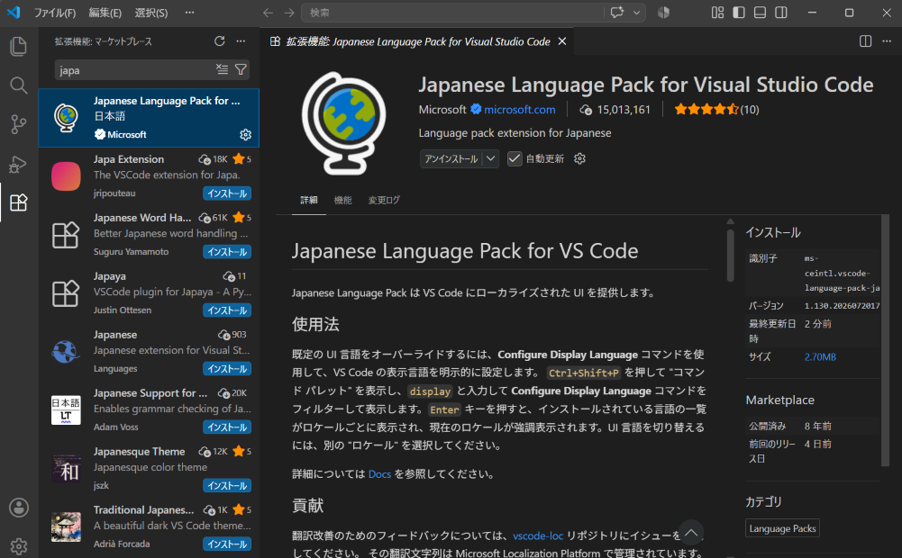

# VS Code のトラブル

---
**目次**
- [(1) アプリケーションフォルダに Visual Studio Code.app がない](#1)
- [(2) html:5 と入力しタブキーを押してもテンプレートが表示されない](#2)
  - [(2-1) HTML ファイルとして保存ができていなかった](#2-1)
  - [(2-2) Emmet が有効になっていなかった](#2-2)
- [(3) インストール時、「Visual Studio Code を実行する」のチェックを外さずに完了をしてしまった](#3)
- [(4) VS Code を使用しようとしたらgitが見つかりませんと表示される](#4)
- [(5) `code` コマンドの設定手順](#5)
- [(6) VS Code が日本語で表示されない](#6)
  - [(6-1) VS Code の拡張機能をインストールする](#6-1)
---

## (1) インストールしたがアプリケーションフォルダに Visual Studio Code.app がない 

次のページをご覧ください。

- [・VS Codeは開けたのですが、アプリケーションフォルダにVisual Studio Code.appがありませんでした](https://www.nnn.ed.nico/questions/28434)

## (2) html:5 と入力しタブキーを押してもテンプレートが表示されない 

テンプレートを作成する際、`html:5` の代わりに `!` と入力することが推奨されるようになりましたが解決策は同じです。

### (2-1) HTML ファイルとして保存ができていなかった 

次のページをご覧ください。

- [・Html:5と入力しタブキーを押してもスペースができるだけで雛形が表示されません](https://www.nnn.ed.nico/questions/27181)

### (2-2) Emmet が有効になっていなかった 

次のページをご覧ください。

- [・vscodeで、html:5でtab押すと展開されるのですか何故か<！DOCTYPE html>は展開されません](https://www.nnn.ed.nico/questions/27330)

## (3) インストール時、「Visual Studio Code を実行する」のチェックを外さずに完了をしてしまった 

次のページをご覧ください。

- [・この①のチェックを外さず完了をしてしまった場合やり直せますか？](https://www.nnn.ed.nico/questions/24568)

## (4) VSCode を使用しようとしたら git が見つかりませんと表示される 

次のページをご覧ください。

- [・VSCodeを使用しようとしたらgitが見つかりませんと表示されてしまいます](https://www.nnn.ed.nico/questions/23518)

## (5) `code` コマンドの設定手順 

VS Code の `code` コマンドを設定する手順です。

### macOS 

1. VS Code を起動します。
1. <kbd>Command</kbd> + <kbd>Shift</kbd> + <kbd>P</kbd> を押して、コマンドパレットを開きます。
1. <q class="font-bold">shell command</q> と入力して、<q class="font-bold">Shell Command: Install 'code' command in PATH</q> を選択します。  
      
    VS Code を日本語で使用している場合は <q class="font-bold">シェル コマンド: PATH 内に 'code' コマンドをインストールします</q> と表示されます。  
    
1. ターミナルを起動している場合は <code>PATH</code> の値を反映するため再起動してください。

### Windows 

Windows では、`code` コマンドは自動的にインストールされています。  
しかし、何らかの理由で `code` コマンドを使用できない場合は次の手順で設定してください。

1. <kbd>Windows</kbd> を押して、そのまま <q class="font-bold">環境変数を編集</q> と入力します。  
    
1. **{Username} のユーザー環境変数(U)** の `Path` を選択して、**編集(E)** をクリックします。  
    
1. **新規(N)** をクリックして、`C:\Users\{Username}\AppData\Local\Programs\Microsoft VS Code\bin` を入力します。  
    入力したら **OK** をクリックして、<q>環境変数名の編集</q> のウィンドウを閉じます。  
    <small>
    `{Username}` はプレースホルダーです。  
    例えばユーザー名が `progedu` の場合は `{Username}` を `progedu` に置き換えてください。
    </small>
    
1. **OK** をクリックして、<q>環境変数</q> のウィンドウを閉じます。  
    
1. PowerShell や Git Bash を起動している場合は <code>PATH</code> の値を反映するため再起動してください。

## (2) VS Code が日本語で表示されない 

VS Code 公式の拡張機能をインストールすることで日本語に変更できます。

### (2-1) VS Code の拡張機能をインストールする 

1. 画面左端に並んでいるアイコンのうち、四角形が 4 つ描かれたボタン（拡張機能のボタン）をクリックします。
    すると、画面左側に EXTENSIONS などと書かれた領域が現れます。
1. 一番上の検索欄に半角英数字で `Japanese` と入力します。
1. **Microsoft** 製の **Japanese Language Pack for Visual Studio Code** という名前の拡張機能であることを確認し、**Install** をクリックしてください。
    
1. インストールが完了すると、画面の右下に 
    `Would you like to change Visual Studio Code's display language to Japanese and restart? （Visual Studio Codeの表示言語を日本語に変更して再起動しますか？）`
    という英語のメッセージが表示されます。 
    日本語で利用したいので、**Change Language and Restart** ボタンをクリックします。
    
1. 自動で VS Code が再起動し、画面表示が日本語に切り替わります。
    

※ 左側に出ていた項目をクリックすると、以下のように拡張機能の詳細が閲覧できます。
